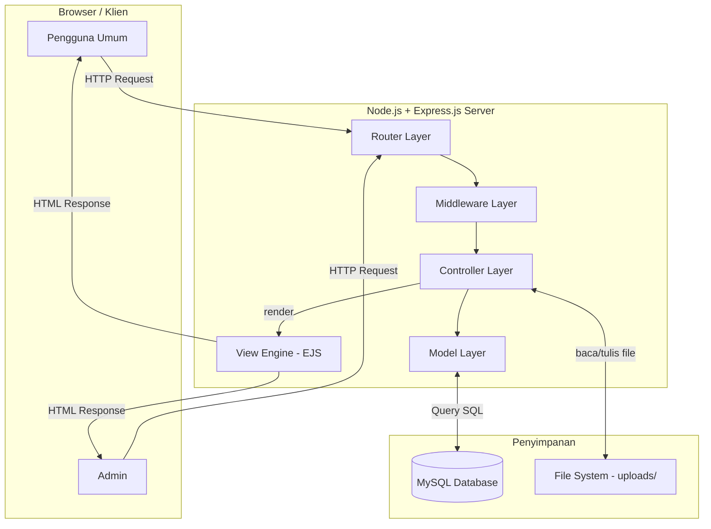
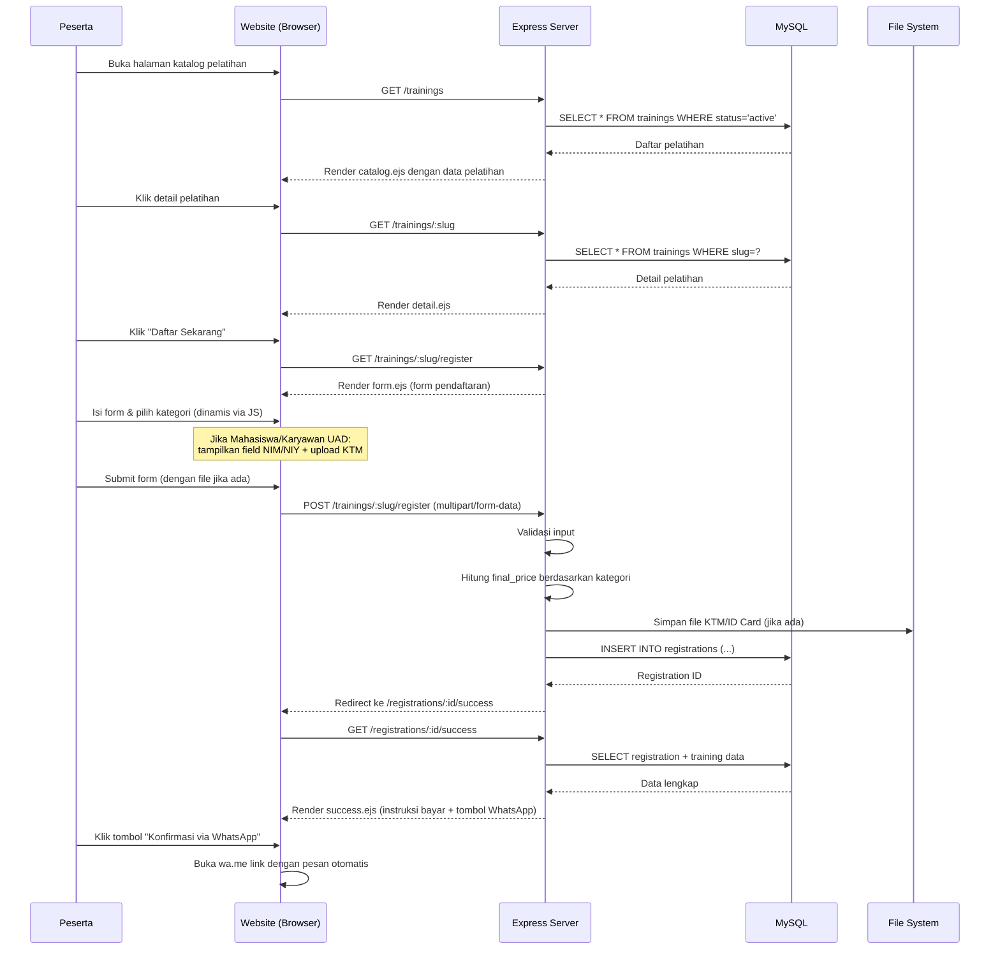
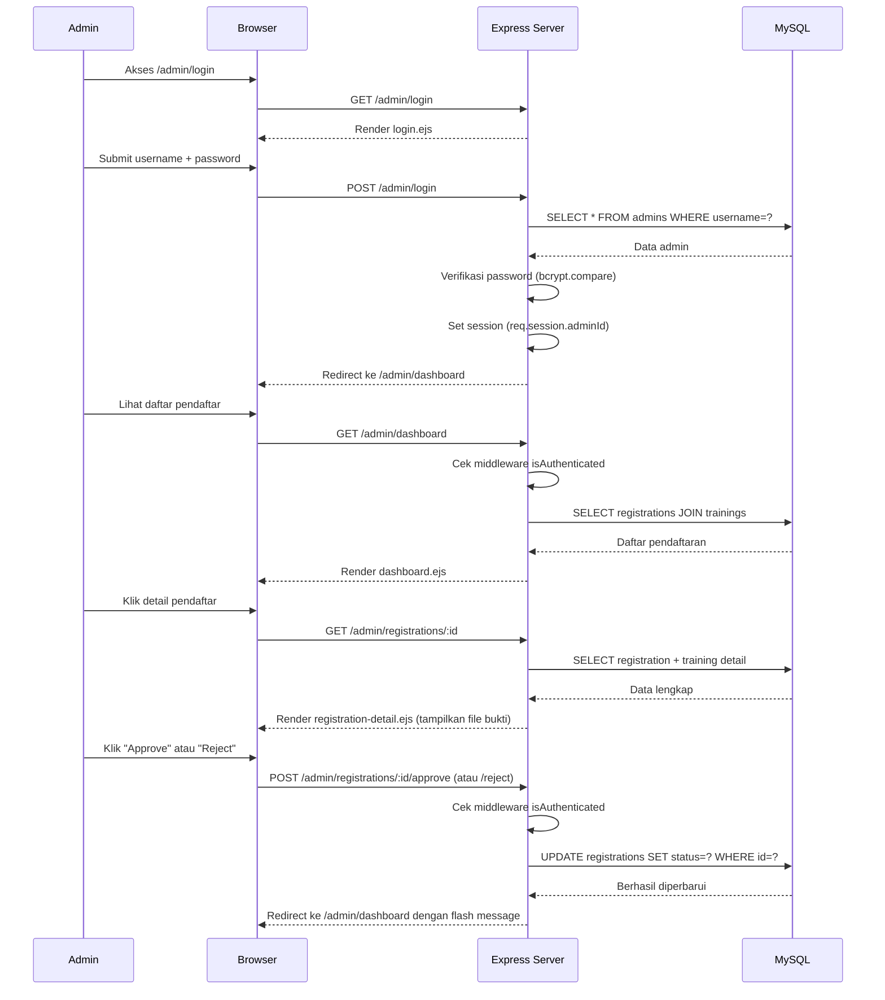
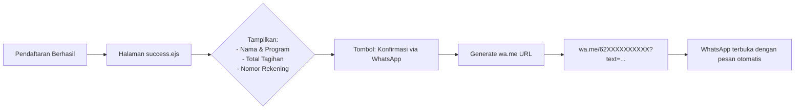

# Design Document: Ahmad Dahlan Training Center (ADTC) Website

## Overview

Ahmad Dahlan Training Center (ADTC) adalah platform website pelatihan berbasis web yang dibangun dengan arsitektur MVC menggunakan Node.js + Express.js di backend, MySQL sebagai database, dan EJS sebagai view engine. Aplikasi ini dirancang **tanpa sistem login peserta** (frictionless), sehingga pendaftaran dapat dilakukan langsung tanpa hambatan akun. Konfirmasi pembayaran dilakukan melalui WhatsApp untuk mempercepat proses verifikasi.

Aplikasi mencakup dua sisi utama: **Portal Publik** (katalog pelatihan, formulir pendaftaran, instruksi pembayaran) dan **Dashboard Admin** (manajemen pelatihan, verifikasi pendaftaran, approve/reject peserta).

---

## Architecture

Sistem menggunakan pola **MVC (Model-View-Controller)** dengan Node.js + Express.js sebagai fondasi.



### Komponen Utama

| Komponen | Teknologi | Peran |
|----------|-----------|-------|
| Web Server | Express.js | Routing, HTTP handling |
| View Engine | EJS | Server-side HTML rendering |
| Database | MySQL (mysql2) | Persistensi data |
| CSS Framework | Tailwind CSS | Styling antarmuka |
| File Upload | Multer | Upload bukti bayar & KTM |
| Session | express-session | Autentikasi admin |
| Environment | dotenv | Konfigurasi rahasia |

### Diagram Alur Data — Pendaftaran Peserta



### Diagram Alur Data — Verifikasi Admin



### Alur Konfirmasi Pembayaran WhatsApp



**Format pesan WhatsApp otomatis**:
```
Halo Admin ADTC, saya telah mendaftar program pelatihan berikut:

Nama   : [Nama Peserta]
Program: [Nama Pelatihan]
Total  : Rp [Final Price]

Mohon konfirmasi pendaftaran saya. Terima kasih.
```

### Ringkasan Endpoint

| Method | Path | Controller | Auth | Deskripsi |
|--------|------|-----------|------|-----------|
| GET | `/` | – | Publik | Redirect ke `/trainings` |
| GET | `/trainings` | publicController.getCatalog | Publik | Katalog pelatihan |
| GET | `/trainings/:slug` | publicController.getTrainingDetail | Publik | Detail pelatihan |
| GET | `/trainings/:slug/register` | registrationController.getForm | Publik | Form pendaftaran |
| POST | `/trainings/:slug/register` | registrationController.submitForm | Publik | Submit pendaftaran |
| GET | `/registrations/:id/success` | registrationController.getSuccess | Publik | Halaman sukses |
| GET | `/admin/login` | adminController.getLogin | Publik | Form login admin |
| POST | `/admin/login` | adminController.postLogin | Publik | Proses login |
| GET | `/admin/logout` | adminController.logout | Admin | Logout |
| GET | `/admin/dashboard` | adminController.getDashboard | Admin | Daftar pendaftaran |
| GET | `/admin/registrations/:id` | adminController.getRegistrationDetail | Admin | Detail pendaftaran |
| POST | `/admin/registrations/:id/approve` | adminController.approveRegistration | Admin | Approve |
| POST | `/admin/registrations/:id/reject` | adminController.rejectRegistration | Admin | Reject |

---

## Components and Interfaces

### Router Layer

**Tujuan**: Mendelegasikan HTTP request ke controller yang sesuai.

**Antarmuka**:
```javascript
// routes/publicRoutes.js
router.get('/trainings', publicController.getCatalog)
router.get('/trainings/:slug', publicController.getTrainingDetail)
router.get('/trainings/:slug/register', registrationController.getForm)
router.post('/trainings/:slug/register', upload.fields([...]), registrationController.submitForm)
router.get('/registrations/:id/success', registrationController.getSuccess)

// routes/adminRoutes.js
router.get('/admin/login', adminController.getLogin)
router.post('/admin/login', adminController.postLogin)
router.get('/admin/logout', adminController.logout)
router.get('/admin/dashboard', isAuthenticated, adminController.getDashboard)
router.get('/admin/registrations/:id', isAuthenticated, adminController.getRegistrationDetail)
router.post('/admin/registrations/:id/approve', isAuthenticated, adminController.approveRegistration)
router.post('/admin/registrations/:id/reject', isAuthenticated, adminController.rejectRegistration)
```

**Tanggung Jawab**:
- Mendefinisikan semua URL endpoint aplikasi
- Menyambungkan middleware (auth, upload) sebelum controller
- Memisahkan rute publik dan rute admin

---

### Controller Layer

**Tujuan**: Memproses logika bisnis, berinteraksi dengan model, dan merender view.

**Antarmuka — `publicController.js`**:
```javascript
const publicController = {
  getCatalog: async (req, res) => {},     // Tampilkan semua pelatihan aktif
  getTrainingDetail: async (req, res) => {} // Tampilkan detail satu pelatihan
}
```

**Antarmuka — `registrationController.js`**:
```javascript
const registrationController = {
  getForm: async (req, res) => {},      // Tampilkan form pendaftaran
  submitForm: async (req, res) => {},   // Proses pendaftaran + kalkulasi harga
  getSuccess: async (req, res) => {}    // Halaman sukses + instruksi WhatsApp
}
```

**Antarmuka — `adminController.js`**:
```javascript
const adminController = {
  getLogin: (req, res) => {},                    // Form login admin
  postLogin: async (req, res) => {},             // Proses login + set session
  logout: (req, res) => {},                      // Hapus session
  getDashboard: async (req, res) => {},          // Daftar semua pendaftaran
  getRegistrationDetail: async (req, res) => {}, // Detail satu pendaftaran
  approveRegistration: async (req, res) => {},   // Ubah status → 'verified'
  rejectRegistration: async (req, res) => {}     // Ubah status → 'rejected'
}
```

---

### Model Layer

**Tujuan**: Abstraksi query database, memisahkan logika data dari controller.

**Antarmuka — `Training` Model**:
```javascript
const Training = {
  findAll: async () => {},            // SELECT semua pelatihan aktif
  findBySlug: async (slug) => {}      // SELECT berdasarkan slug
}
```

**Antarmuka — `Registration` Model**:
```javascript
const Registration = {
  create: async (data) => {},         // INSERT pendaftaran baru
  findById: async (id) => {},         // SELECT + JOIN training
  findAll: async (filters) => {},     // SELECT semua + JOIN + filter
  updateStatus: async (id, status) => {} // UPDATE status
}
```

**Antarmuka — `Admin` Model**:
```javascript
const Admin = {
  findByUsername: async (username) => {} // SELECT untuk proses login
}
```

---

### Middleware Layer

**Tujuan**: Menangani autentikasi admin dan konfigurasi upload file.

**Antarmuka — `middleware/auth.js`**:
```javascript
const isAuthenticated = (req, res, next) => {
  // Cek req.session.adminId
  // Jika ada → next()
  // Jika tidak → redirect ke /admin/login
}
```

**Antarmuka — `middleware/upload.js`**:
```javascript
// Konfigurasi Multer:
// - payment_proofs/ → untuk bukti pembayaran
// - identity_cards/ → untuk KTM/ID Card
const upload = multer({
  storage: diskStorage({ destination, filename }),
  fileFilter,
  limits: { fileSize: 5 * 1024 * 1024 } // 5MB
})
```

---

### Implementasi Detail

#### Entry Point — `app.js`

```javascript
// app.js
require('dotenv').config()
const express = require('express')
const session = require('express-session')
const flash = require('connect-flash')
const path = require('path')

const publicRoutes = require('./routes/publicRoutes')
const adminRoutes = require('./routes/adminRoutes')

const app = express()
const PORT = process.env.PORT || 3000

// View Engine
app.set('view engine', 'ejs')
app.set('views', path.join(__dirname, 'views'))

// Middleware Global
app.use(express.urlencoded({ extended: true }))
app.use(express.json())
app.use(express.static(path.join(__dirname, 'public')))

// Session
app.use(session({
  secret: process.env.SESSION_SECRET,
  resave: false,
  saveUninitialized: false,
  cookie: { secure: false, maxAge: 1000 * 60 * 60 * 24 } // 24 jam
}))

// Flash Messages
app.use(flash())
app.use((req, res, next) => {
  res.locals.success_msg = req.flash('success')
  res.locals.error_msg = req.flash('error')
  res.locals.adminUser = req.session.adminId || null
  next()
})

// Routes
app.use('/', publicRoutes)
app.use('/admin', adminRoutes)

// 404 Handler
app.use((req, res) => {
  res.status(404).render('error', { message: 'Halaman tidak ditemukan', code: 404 })
})

// 500 Handler
app.use((err, req, res, next) => {
  console.error(err.stack)
  res.status(500).render('error', { message: 'Terjadi kesalahan server', code: 500 })
})

app.listen(PORT, () => {
  console.log(`Server ADTC berjalan di http://localhost:${PORT}`)
})

module.exports = app
```

#### Modul Koneksi Database — `config/db.js`

```javascript
// config/db.js
const mysql = require('mysql2')

/**
 * Connection Pool MySQL menggunakan mysql2
 * Menggunakan pool (bukan single connection) untuk performa lebih baik.
 *
 * Preconditions:
 *   - Environment variables DB_HOST, DB_USER, DB_PASSWORD, DB_NAME harus terdefinisi
 *   - MySQL server harus dapat dijangkau pada host:port yang ditentukan
 *
 * Postconditions:
 *   - Mengembalikan pool object yang siap digunakan (promise-based)
 */
const pool = mysql.createPool({
  host:               process.env.DB_HOST     || 'localhost',
  port:               parseInt(process.env.DB_PORT) || 3306,
  user:               process.env.DB_USER,
  password:           process.env.DB_PASSWORD,
  database:           process.env.DB_NAME,
  waitForConnections: true,
  connectionLimit:    10,
  queueLimit:         0
})

// Ekspor sebagai promise pool agar bisa menggunakan async/await
module.exports = pool.promise()
```

#### `models/Training.js`

```javascript
// models/Training.js
const db = require('../config/db')

const Training = {

  /**
   * Ambil semua pelatihan dengan status 'active'.
   *
   * Postconditions:
   *   - Mengembalikan array of training objects
   *   - Array kosong jika tidak ada pelatihan aktif
   */
  async findAll() {
    const [rows] = await db.execute(
      `SELECT * FROM trainings WHERE status = 'active' ORDER BY start_date ASC`
    )
    return rows
  },

  /**
   * Ambil satu pelatihan berdasarkan slug.
   *
   * Preconditions:  slug adalah string non-kosong
   * Postconditions: Mengembalikan objek training atau null jika tidak ditemukan
   */
  async findBySlug(slug) {
    const [rows] = await db.execute(
      'SELECT * FROM trainings WHERE slug = ? LIMIT 1',
      [slug]
    )
    return rows[0] || null
  }
}

module.exports = Training
```

#### `models/Registration.js`

```javascript
// models/Registration.js
const db = require('../config/db')

const Registration = {

  /**
   * Simpan data pendaftaran baru ke database.
   *
   * Preconditions:
   *   - data.training_id harus ada di tabel trainings
   *   - data.category harus salah satu dari: 'umum', 'mahasiswa_uad', 'karyawan_uad'
   *   - data.final_price harus bilangan positif
   *
   * Postconditions:
   *   - Mengembalikan insertId dari record baru
   *   - Status default 'pending'
   */
  async create(data) {
    const {
      training_id, full_name, email, phone, category,
      identity_number, identity_card_proof, final_price
    } = data

    const [result] = await db.execute(
      `INSERT INTO registrations
        (training_id, full_name, email, phone, category,
         identity_number, identity_card_proof, final_price)
       VALUES (?, ?, ?, ?, ?, ?, ?, ?)`,
      [training_id, full_name, email, phone, category,
       identity_number || null, identity_card_proof || null, final_price]
    )
    return result.insertId
  },

  /**
   * Ambil satu pendaftaran beserta detail pelatihan berdasarkan ID.
   *
   * Postconditions:
   *   - Mengembalikan objek gabungan registrations + trainings
   *   - null jika ID tidak ditemukan
   */
  async findById(id) {
    const [rows] = await db.execute(
      `SELECT r.*, t.title AS training_title, t.slug AS training_slug,
              t.start_date, t.description AS training_description
       FROM registrations r
       JOIN trainings t ON r.training_id = t.id
       WHERE r.id = ?
       LIMIT 1`,
      [id]
    )
    return rows[0] || null
  },

  /**
   * Ambil semua pendaftaran dengan JOIN training.
   * Mendukung filter berdasarkan status.
   *
   * Postconditions:
   *   - Mengembalikan array (bisa kosong)
   *   - Diurutkan berdasarkan created_at DESC
   */
  async findAll(filters = {}) {
    let query = `
      SELECT r.*, t.title AS training_title
      FROM registrations r
      JOIN trainings t ON r.training_id = t.id
    `
    const params = []

    if (filters.status) {
      query += ' WHERE r.status = ?'
      params.push(filters.status)
    }

    query += ' ORDER BY r.created_at DESC'
    const [rows] = await db.execute(query, params)
    return rows
  },

  /**
   * Perbarui status pendaftaran.
   *
   * Preconditions:
   *   - status harus salah satu dari: 'pending', 'verified', 'rejected'
   *
   * Postconditions:
   *   - Mengembalikan affectedRows (1 jika berhasil, 0 jika ID tidak ditemukan)
   */
  async updateStatus(id, status) {
    const [result] = await db.execute(
      'UPDATE registrations SET status = ? WHERE id = ?',
      [status, id]
    )
    return result.affectedRows
  }
}

module.exports = Registration
```

#### `models/Admin.js`

```javascript
// models/Admin.js
const db = require('../config/db')

const Admin = {

  /**
   * Cari admin berdasarkan username untuk proses login.
   *
   * Postconditions:
   *   - Mengembalikan objek admin (termasuk password_hash) atau null
   */
  async findByUsername(username) {
    const [rows] = await db.execute(
      'SELECT * FROM admins WHERE username = ? LIMIT 1',
      [username]
    )
    return rows[0] || null
  }
}

module.exports = Admin
```

#### `controllers/publicController.js`

```javascript
// controllers/publicController.js
const Training = require('../models/Training')

const publicController = {

  /**
   * GET /trainings
   * Tampilkan katalog semua pelatihan aktif.
   *
   * Postconditions:
   *   - Render catalog.ejs dengan array trainings
   *   - trainings bisa array kosong (tidak error)
   */
  getCatalog: async (req, res) => {
    try {
      const trainings = await Training.findAll()
      res.render('trainings/catalog', { trainings, title: 'Katalog Pelatihan ADTC' })
    } catch (err) {
      next(err)
    }
  },

  /**
   * GET /trainings/:slug
   * Tampilkan detail satu pelatihan.
   *
   * Postconditions:
   *   - Render detail.ejs jika training ditemukan
   *   - 404 jika slug tidak ada di database
   */
  getTrainingDetail: async (req, res, next) => {
    try {
      const training = await Training.findBySlug(req.params.slug)
      if (!training) {
        return res.status(404).render('error', {
          message: 'Pelatihan tidak ditemukan', code: 404
        })
      }
      res.render('trainings/detail', { training, title: training.title })
    } catch (err) {
      next(err)
    }
  }
}

module.exports = publicController
```

#### `controllers/registrationController.js`

```javascript
// controllers/registrationController.js
const Training = require('../models/Training')
const Registration = require('../models/Registration')

/**
 * Kalkulasi harga final berdasarkan kategori peserta.
 *
 * Preconditions:
 *   - category adalah salah satu dari: 'umum', 'mahasiswa_uad', 'karyawan_uad'
 *   - training adalah objek valid dengan ketiga field price
 *
 * Postconditions:
 *   - Mengembalikan angka positif sesuai kategori
 *   - Jika category tidak dikenal, mengembalikan price_general sebagai fallback
 *
 * Loop Invariants: N/A (fungsi non-iteratif)
 */
function calculateFinalPrice(category, training) {
  const priceMap = {
    'umum':          training.price_general,
    'mahasiswa_uad': training.price_student_uad,
    'karyawan_uad':  training.price_employee_uad
  }
  return priceMap[category] ?? training.price_general
}

/**
 * Validasi data form pendaftaran.
 *
 * Preconditions:  body adalah object dari req.body
 * Postconditions:
 *   - Mengembalikan { valid: true, errors: [] } jika semua valid
 *   - Mengembalikan { valid: false, errors: [...] } jika ada yang tidak valid
 */
function validateRegistrationInput(body, files) {
  const errors = []
  const { full_name, email, phone, category } = body

  if (!full_name || full_name.trim().length < 3)
    errors.push('Nama lengkap minimal 3 karakter.')
  if (!email || !/^[^\s@]+@[^\s@]+\.[^\s@]+$/.test(email))
    errors.push('Format email tidak valid.')
  if (!phone || phone.replace(/\D/g, '').length < 10)
    errors.push('Nomor telepon minimal 10 digit.')
  if (!['umum', 'mahasiswa_uad', 'karyawan_uad'].includes(category))
    errors.push('Kategori peserta tidak valid.')

  // Validasi khusus untuk mahasiswa/karyawan UAD
  if (category === 'mahasiswa_uad' || category === 'karyawan_uad') {
    if (!body.identity_number || body.identity_number.trim().length < 5)
      errors.push('NIM/NIY wajib diisi untuk kategori UAD.')
    if (!files?.identity_card_proof?.[0])
      errors.push('File KTM/ID Card wajib diupload untuk kategori UAD.')
  }

  return { valid: errors.length === 0, errors }
}

const registrationController = {

  /**
   * GET /trainings/:slug/register
   * Tampilkan form pendaftaran untuk pelatihan tertentu.
   */
  getForm: async (req, res, next) => {
    try {
      const training = await Training.findBySlug(req.params.slug)
      if (!training) {
        return res.status(404).render('error', {
          message: 'Pelatihan tidak ditemukan', code: 404
        })
      }
      res.render('registration/form', {
        training,
        title: `Daftar - ${training.title}`,
        errors: [],
        formData: {}
      })
    } catch (err) {
      next(err)
    }
  },

  /**
   * POST /trainings/:slug/register
   * Proses form pendaftaran.
   *
   * Alur:
   *   1. Ambil data training berdasarkan slug
   *   2. Validasi semua input
   *   3. Hitung final_price berdasarkan kategori
   *   4. Simpan ke database
   *   5. Redirect ke halaman sukses
   */
  submitForm: async (req, res, next) => {
    try {
      const training = await Training.findBySlug(req.params.slug)
      if (!training) {
        return res.status(404).render('error', {
          message: 'Pelatihan tidak ditemukan', code: 404
        })
      }

      // Validasi input
      const { valid, errors } = validateRegistrationInput(req.body, req.files)
      if (!valid) {
        return res.render('registration/form', {
          training,
          title: `Daftar - ${training.title}`,
          errors,
          formData: req.body
        })
      }

      // Kalkulasi harga
      const final_price = calculateFinalPrice(req.body.category, training)

      // Path file (jika ada)
      const identity_card_proof = req.files?.identity_card_proof?.[0]?.path || null

      // Simpan ke database
      const registrationId = await Registration.create({
        training_id:         training.id,
        full_name:           req.body.full_name.trim(),
        email:               req.body.email.trim().toLowerCase(),
        phone:               req.body.phone.trim(),
        category:            req.body.category,
        identity_number:     req.body.identity_number?.trim() || null,
        identity_card_proof,
        final_price
      })

      res.redirect(`/registrations/${registrationId}/success`)
    } catch (err) {
      next(err)
    }
  },

  /**
   * GET /registrations/:id/success
   * Tampilkan halaman sukses dengan instruksi pembayaran dan tombol WhatsApp.
   */
  getSuccess: async (req, res, next) => {
    try {
      const registration = await Registration.findById(req.params.id)
      if (!registration) {
        return res.status(404).render('error', {
          message: 'Data pendaftaran tidak ditemukan', code: 404
        })
      }

      const whatsappUrl = generateWhatsAppUrl(
        registration.full_name,
        registration.training_title,
        registration.final_price
      )

      res.render('registration/success', {
        registration,
        whatsappUrl,
        bankAccount: {
          bankName:      process.env.BANK_NAME      || 'Bank Muamalat',
          accountNumber: process.env.BANK_ACCOUNT   || '0000000000',
          accountName:   process.env.BANK_ACC_NAME  || 'Ahmad Dahlan Training Center'
        },
        title: 'Pendaftaran Berhasil'
      })
    } catch (err) {
      next(err)
    }
  }
}

module.exports = registrationController
module.exports.calculateFinalPrice = calculateFinalPrice
module.exports.validateRegistrationInput = validateRegistrationInput
```

#### `controllers/adminController.js`

```javascript
// controllers/adminController.js
const bcrypt = require('bcrypt')
const Admin = require('../models/Admin')
const Registration = require('../models/Registration')

const adminController = {

  /** GET /admin/login */
  getLogin: (req, res) => {
    if (req.session.adminId) return res.redirect('/admin/dashboard')
    res.render('admin/login', { title: 'Login Admin ADTC' })
  },

  /**
   * POST /admin/login
   * Verifikasi kredensial admin dan buat session.
   *
   * Preconditions:  req.body.username dan req.body.password tidak kosong
   * Postconditions:
   *   - Jika valid: set req.session.adminId, redirect ke dashboard
   *   - Jika invalid: flash error, redirect ke login
   */
  postLogin: async (req, res, next) => {
    try {
      const { username, password } = req.body
      const admin = await Admin.findByUsername(username)

      if (!admin) {
        req.flash('error', 'Username atau password salah.')
        return res.redirect('/admin/login')
      }

      const isMatch = await bcrypt.compare(password, admin.password_hash)
      if (!isMatch) {
        req.flash('error', 'Username atau password salah.')
        return res.redirect('/admin/login')
      }

      req.session.adminId = admin.id
      req.session.adminUsername = admin.username
      res.redirect('/admin/dashboard')
    } catch (err) {
      next(err)
    }
  },

  /** GET /admin/logout */
  logout: (req, res) => {
    req.session.destroy(() => {
      res.redirect('/admin/login')
    })
  },

  /**
   * GET /admin/dashboard
   * Tampilkan semua pendaftaran masuk (dilindungi middleware isAuthenticated).
   */
  getDashboard: async (req, res, next) => {
    try {
      const { status } = req.query
      const registrations = await Registration.findAll(status ? { status } : {})
      res.render('admin/dashboard', {
        registrations,
        title: 'Dashboard Admin',
        activeFilter: status || 'all'
      })
    } catch (err) {
      next(err)
    }
  },

  /**
   * GET /admin/registrations/:id
   * Tampilkan detail satu pendaftaran beserta file bukti.
   */
  getRegistrationDetail: async (req, res, next) => {
    try {
      const registration = await Registration.findById(req.params.id)
      if (!registration) {
        return res.status(404).render('error', {
          message: 'Pendaftaran tidak ditemukan', code: 404
        })
      }
      res.render('admin/registration-detail', {
        registration,
        title: `Detail Pendaftaran #${registration.id}`
      })
    } catch (err) {
      next(err)
    }
  },

  /**
   * POST /admin/registrations/:id/approve
   * Ubah status pendaftaran menjadi 'verified'.
   */
  approveRegistration: async (req, res, next) => {
    try {
      await Registration.updateStatus(req.params.id, 'verified')
      req.flash('success', 'Pendaftaran berhasil diverifikasi.')
      res.redirect('/admin/dashboard')
    } catch (err) {
      next(err)
    }
  },

  /**
   * POST /admin/registrations/:id/reject
   * Ubah status pendaftaran menjadi 'rejected'.
   */
  rejectRegistration: async (req, res, next) => {
    try {
      await Registration.updateStatus(req.params.id, 'rejected')
      req.flash('error', 'Pendaftaran telah ditolak.')
      res.redirect('/admin/dashboard')
    } catch (err) {
      next(err)
    }
  }
}

module.exports = adminController
```

#### `middleware/auth.js`

```javascript
// middleware/auth.js

/**
 * Middleware: Proteksi route admin.
 *
 * Preconditions:  req.session tersedia (express-session telah dikonfigurasi)
 * Postconditions:
 *   - Jika req.session.adminId ada → next() dipanggil
 *   - Jika tidak ada → redirect ke /admin/login
 */
const isAuthenticated = (req, res, next) => {
  if (req.session && req.session.adminId) {
    return next()
  }
  req.flash('error', 'Silakan login terlebih dahulu.')
  res.redirect('/admin/login')
}

module.exports = { isAuthenticated }
```

#### `middleware/upload.js`

```javascript
// middleware/upload.js
const multer = require('multer')
const path = require('path')
const fs = require('fs')

const ensureDir = (dir) => {
  if (!fs.existsSync(dir)) fs.mkdirSync(dir, { recursive: true })
}

/**
 * Konfigurasi penyimpanan file Multer.
 * - Bukti pembayaran → uploads/payment_proofs/
 * - KTM / ID Card   → uploads/identity_cards/
 * Penamaan file: [fieldname]-[timestamp].[ext]
 */
const storage = multer.diskStorage({
  destination: (req, file, cb) => {
    let dest = 'uploads/identity_cards'
    if (file.fieldname === 'payment_proof') {
      dest = 'uploads/payment_proofs'
    }
    ensureDir(dest)
    cb(null, dest)
  },
  filename: (req, file, cb) => {
    const ext = path.extname(file.originalname).toLowerCase()
    const uniqueName = `${file.fieldname}-${Date.now()}${ext}`
    cb(null, uniqueName)
  }
})

/**
 * Filter tipe file yang diizinkan.
 *
 * Postconditions:
 *   - Hanya .jpg, .jpeg, .png, .pdf yang diterima
 *   - File lain ditolak dengan pesan error deskriptif
 */
const fileFilter = (req, file, cb) => {
  const allowedTypes = /jpeg|jpg|png|pdf/
  const extValid = allowedTypes.test(path.extname(file.originalname).toLowerCase())
  const mimeValid = allowedTypes.test(file.mimetype)

  if (extValid && mimeValid) {
    cb(null, true)
  } else {
    cb(new Error('Format file tidak didukung. Gunakan JPG, PNG, atau PDF.'))
  }
}

const upload = multer({
  storage,
  fileFilter,
  limits: { fileSize: 5 * 1024 * 1024 } // Maksimal 5MB
})

module.exports = upload
```

#### `utils/whatsapp.js`

```javascript
// utils/whatsapp.js

/**
 * Generate URL WhatsApp untuk konfirmasi pembayaran.
 *
 * Preconditions:
 *   - name adalah string non-kosong
 *   - program adalah string non-kosong
 *   - price adalah angka positif
 *   - WHATSAPP_ADMIN_NUMBER tersedia di environment variable
 *
 * Postconditions:
 *   - Mengembalikan URL string dimulai dengan 'https://wa.me/'
 *   - URL mengandung nomor admin yang sudah dibersihkan (tanpa +, spasi, strip)
 *   - Parameter text sudah di-encode dengan encodeURIComponent
 *   - Pesan mengandung nama, program, dan harga yang diformat
 */
function generateWhatsAppUrl(name, program, price) {
  const adminNumber = (process.env.WHATSAPP_ADMIN_NUMBER || '628123456789')
    .replace(/[^0-9]/g, '')

  const formattedPrice = new Intl.NumberFormat('id-ID', {
    style: 'currency',
    currency: 'IDR',
    minimumFractionDigits: 0
  }).format(price)

  const message = `Halo Admin ADTC, saya telah mendaftar program pelatihan berikut:\n\nNama   : ${name}\nProgram: ${program}\nTotal  : ${formattedPrice}\n\nMohon konfirmasi pendaftaran saya. Terima kasih.`

  return `https://wa.me/${adminNumber}?text=${encodeURIComponent(message)}`
}

module.exports = { generateWhatsAppUrl }
```

#### Struktur File Proyek

```
adtcwebsite/
├── app.js
├── .env
├── .env.example
├── package.json
├── tailwind.config.js
│
├── config/
│   └── db.js
│
├── controllers/
│   ├── publicController.js
│   ├── registrationController.js
│   └── adminController.js
│
├── models/
│   ├── Training.js
│   ├── Registration.js
│   └── Admin.js
│
├── routes/
│   ├── publicRoutes.js
│   └── adminRoutes.js
│
├── views/
│   ├── layout/
│   │   └── main.ejs
│   ├── trainings/
│   │   ├── catalog.ejs
│   │   └── detail.ejs
│   ├── registration/
│   │   ├── form.ejs
│   │   └── success.ejs
│   ├── admin/
│   │   ├── login.ejs
│   │   ├── dashboard.ejs
│   │   └── registration-detail.ejs
│   └── error.ejs
│
├── middleware/
│   ├── auth.js
│   └── upload.js
│
├── utils/
│   └── whatsapp.js
│
├── public/
│   ├── css/
│   │   └── output.css
│   └── js/
│       └── registration-form.js
│
└── uploads/
    ├── payment_proofs/
    └── identity_cards/
```

#### Template EJS Kunci

**`views/layout/main.ejs`**:
```html
<!DOCTYPE html>
<html lang="id">
<head>
  <meta charset="UTF-8" />
  <meta name="viewport" content="width=device-width, initial-scale=1.0" />
  <title><%= title %> | ADTC</title>
  <link rel="stylesheet" href="/css/output.css" />
</head>
<body class="bg-gray-50 min-h-screen flex flex-col">
  <nav class="bg-blue-700 text-white shadow-md">
    <div class="container mx-auto px-4 py-3 flex justify-between items-center">
      <a href="/trainings" class="font-bold text-xl">ADTC</a>
      <a href="/trainings" class="hover:underline text-sm">Katalog Pelatihan</a>
    </div>
  </nav>
  <% if (success_msg && success_msg.length > 0) { %>
    <div class="bg-green-100 border border-green-400 text-green-800 px-4 py-3 mx-4 mt-4 rounded">
      <%= success_msg %>
    </div>
  <% } %>
  <% if (error_msg && error_msg.length > 0) { %>
    <div class="bg-red-100 border border-red-400 text-red-800 px-4 py-3 mx-4 mt-4 rounded">
      <%= error_msg %>
    </div>
  <% } %>
  <main class="container mx-auto px-4 py-8 flex-grow">
    <%- body %>
  </main>
  <footer class="bg-gray-800 text-gray-300 text-center py-4 text-sm">
    &copy; <%= new Date().getFullYear() %> Ahmad Dahlan Training Center
  </footer>
</body>
</html>
```

**`public/js/registration-form.js`**:
```javascript
/**
 * Logika form pendaftaran dinamis.
 *
 * Preconditions:
 *   - Elemen #categorySelect dan #uadFields ada di DOM
 *
 * Postconditions:
 *   - #uadFields terlihat hanya saat kategori UAD dipilih
 *   - Attribute 'required' pada input UAD menyesuaikan visibilitas
 */
document.addEventListener('DOMContentLoaded', () => {
  const categorySelect = document.getElementById('categorySelect')
  const uadFields = document.getElementById('uadFields')
  const uadInputs = uadFields.querySelectorAll('input')

  function toggleUadFields() {
    const isUad = ['mahasiswa_uad', 'karyawan_uad'].includes(categorySelect.value)

    if (isUad) {
      uadFields.classList.remove('hidden')
      uadInputs.forEach(input => input.setAttribute('required', 'required'))
    } else {
      uadFields.classList.add('hidden')
      uadInputs.forEach(input => input.removeAttribute('required'))
    }
  }

  categorySelect.addEventListener('change', toggleUadFields)
  toggleUadFields()
})
```

---

## Data Models

### Tabel `trainings`

```sql
CREATE TABLE trainings (
  id                  INT AUTO_INCREMENT PRIMARY KEY,
  title               VARCHAR(255)    NOT NULL,
  slug                VARCHAR(255)    NOT NULL UNIQUE,
  description         TEXT,
  price_general       DECIMAL(10,2)   NOT NULL,
  price_student_uad   DECIMAL(10,2)   NOT NULL,
  price_employee_uad  DECIMAL(10,2)   NOT NULL,
  quota               INT             NOT NULL DEFAULT 30,
  start_date          DATE,
  status              ENUM('active', 'inactive', 'full') DEFAULT 'active',
  created_at          TIMESTAMP       DEFAULT CURRENT_TIMESTAMP
);
```

**Aturan Validasi**:
- `slug` harus unik, lowercase, hanya huruf-angka-strip
- `price_*` tidak boleh negatif
- `quota` minimal 1

### Tabel `registrations`

```sql
CREATE TABLE registrations (
  id                  INT AUTO_INCREMENT PRIMARY KEY,
  training_id         INT             NOT NULL,
  full_name           VARCHAR(255)    NOT NULL,
  email               VARCHAR(255)    NOT NULL,
  phone               VARCHAR(20)     NOT NULL,
  category            ENUM('umum', 'mahasiswa_uad', 'karyawan_uad') NOT NULL,
  identity_number     VARCHAR(50),
  identity_card_proof VARCHAR(500),
  final_price         DECIMAL(10,2)   NOT NULL,
  payment_proof       VARCHAR(500),
  status              ENUM('pending', 'verified', 'rejected') DEFAULT 'pending',
  created_at          TIMESTAMP       DEFAULT CURRENT_TIMESTAMP,
  FOREIGN KEY (training_id) REFERENCES trainings(id)
);
```

**Aturan Validasi**:
- `identity_number` wajib jika `category` = `mahasiswa_uad` atau `karyawan_uad`
- `identity_card_proof` wajib jika `category` bukan `umum`
- `email` harus format valid
- `phone` minimal 10 digit

### Tabel `admins`

```sql
CREATE TABLE admins (
  id            INT AUTO_INCREMENT PRIMARY KEY,
  username      VARCHAR(100)    NOT NULL UNIQUE,
  password_hash VARCHAR(255)    NOT NULL,
  created_at    TIMESTAMP       DEFAULT CURRENT_TIMESTAMP
);
```

### Konfigurasi Environment Variables

```bash
# .env.example
PORT=3000
NODE_ENV=development

# Database MySQL
DB_HOST=localhost
DB_PORT=3306
DB_USER=root
DB_PASSWORD=password_anda
DB_NAME=adtc_db

# Session
SESSION_SECRET=ganti_dengan_string_acak_yang_panjang_dan_aman

# WhatsApp Admin (format: kode negara + nomor, tanpa +)
WHATSAPP_ADMIN_NUMBER=628123456789

# Rekening Bank ADTC
BANK_NAME=Bank Muamalat
BANK_ACCOUNT=0000000000
BANK_ACC_NAME=Ahmad Dahlan Training Center
```

### Dependensi

```json
{
  "dependencies": {
    "express": "^4.18.2",
    "ejs": "^3.1.9",
    "mysql2": "^3.6.1",
    "multer": "^1.4.5-lts.1",
    "bcrypt": "^5.1.1",
    "express-session": "^1.17.3",
    "connect-flash": "^0.1.1",
    "dotenv": "^16.3.1",
    "slugify": "^1.6.6"
  },
  "devDependencies": {
    "tailwindcss": "^3.3.5",
    "nodemon": "^3.0.1"
  }
}
```

---

## Correctness Properties

*A property is a characteristic or behavior that should hold true across all valid executions of a system — essentially, a formal statement about what the system should do. Properties serve as the bridge between human-readable specifications and machine-verifiable correctness guarantees.*

### Property 1: Kalkulasi Harga Sesuai Kategori

*For any* Training dengan `price_general`, `price_student_uad`, dan `price_employee_uad` bernilai positif, dan untuk setiap Kategori yang valid (`umum`, `mahasiswa_uad`, `karyawan_uad`), fungsi `calculateFinalPrice(category, training)` harus mengembalikan nilai yang identik dengan field harga yang sesuai kategori tersebut, dan hasilnya selalu positif.

**Validates: Requirements 3.1, 3.2, 3.3**

### Property 2: Konsistensi Final Price Tersimpan di Database

*For any* Registration yang tersimpan di database, nilai `final_price` SHALL selalu sama dengan hasil pemanggilan ulang `calculateFinalPrice(registration.category, training)` menggunakan data Training yang sama, sehingga tidak ada Registration dengan harga yang tidak konsisten dengan kategorinya.

**Validates: Requirements 3.5, 3.6**

### Property 3: URL WhatsApp Selalu Valid dan Mengandung Data Peserta

*For any* kombinasi `name` non-kosong, `program` non-kosong, dan `price` bernilai positif, fungsi `generateWhatsAppUrl(name, program, price)` harus mengembalikan string URL yang diawali `https://wa.me/`, mengandung nomor admin (hanya digit), dan mengandung pesan yang sudah di-encode yang menyertakan nama peserta, nama program, dan harga dalam format Rupiah.

**Validates: Requirements 5.5, 5.6, 5.7**

### Property 4: Status Pendaftaran Selalu Berada dalam State Valid

*For any* Registration, baik pada saat pembuatan maupun setelah operasi approve atau reject, nilai `status` SHALL selalu berada dalam satu dari tiga state yang valid: `'pending'`, `'verified'`, atau `'rejected'`; tidak ada status lain yang dapat tersimpan di database.

**Validates: Requirements 5.1, 7.6, 7.7**

### Property 5: Field Identitas UAD Wajib Ada untuk Kategori UAD

*For any* Registration dengan `category` bernilai `mahasiswa_uad` atau `karyawan_uad`, fungsi `validateRegistrationInput` harus mengembalikan `valid: false` jika `identity_number` tidak ada atau kurang dari 5 karakter, dan harus mengembalikan `valid: false` jika file `identity_card_proof` tidak dilampirkan.

**Validates: Requirements 2.10, 2.11**

### Property 6: Validasi Input Menolak Semua Input Tidak Valid

*For any* kombinasi input form pendaftaran yang melanggar aturan validasi (nama < 3 karakter, email tidak sesuai format, telepon < 10 digit, atau kategori di luar nilai yang diizinkan), fungsi `validateRegistrationInput` SHALL mengembalikan `{ valid: false, errors: [...] }` dengan array `errors` yang tidak kosong dan berisi pesan deskriptif.

**Validates: Requirements 2.6, 2.7, 2.8, 2.9**

### Property 7: File Filter Menerima Semua Format Valid dan Menolak Format Tidak Valid

*For any* file dengan ekstensi dan MIME type yang termasuk dalam `jpeg`, `jpg`, `png`, `pdf`, fungsi `fileFilter` Multer SHALL menerimanya (memanggil `cb(null, true)`). *For any* file dengan ekstensi atau MIME type di luar daftar tersebut, fungsi `fileFilter` SHALL menolaknya dengan memanggil `cb(new Error(...))`.

**Validates: Requirements 4.1, 4.3, 10.3**

### Property 8: Middleware Auth Melindungi Semua Route Admin

*For any* HTTP request ke route admin yang dilindungi (selain `/admin/login`), jika request tidak memiliki `req.session.adminId` yang valid, middleware `isAuthenticated` SHALL selalu melakukan redirect ke `/admin/login` tanpa memanggil `next()`, sehingga tidak ada route admin yang dapat diakses tanpa autentikasi.

**Validates: Requirements 6.7, 7.8**

### Property 9: Filter Dashboard Mengembalikan Hanya Registration Sesuai Status

*For any* nilai status filter yang diberikan ke `Registration.findAll({ status })`, semua Registration yang dikembalikan SHALL memiliki nilai `status` yang identik dengan filter, tanpa ada Registration dengan status berbeda yang tersisip dalam hasil.

**Validates: Requirements 7.2**

---

## Error Handling

### Skenario Error 1: Validasi Form Pendaftaran

**Kondisi**: Input tidak lengkap atau tidak valid (email salah, field kosong)
**Respons**: Flash message error + redirect ke form dengan data terisi ulang
**Pemulihan**: Pengguna memperbaiki input tanpa kehilangan data yang sudah diisi

### Skenario Error 2: Pelatihan Tidak Ditemukan

**Kondisi**: Slug tidak ada di database
**Respons**: HTTP 404, render halaman error dengan pesan ramah
**Pemulihan**: Link navigasi kembali ke katalog

### Skenario Error 3: File Upload Gagal / Ukuran Terlalu Besar

**Kondisi**: File > 5MB atau format tidak didukung
**Respons**: Flash message dengan penjelasan batas ukuran/format
**Pemulihan**: Form tetap terbuka, pengguna pilih file lain

### Skenario Error 4: Login Admin Gagal

**Kondisi**: Username/password salah
**Respons**: Pesan error "Username atau password salah", form login kembali ditampilkan
**Pemulihan**: Admin coba login ulang (tidak ada lockout di v1)

### Skenario Error 5: Database Connection Error

**Kondisi**: MySQL tidak dapat dijangkau
**Respons**: HTTP 500, log error ke console/file, render halaman error generik
**Pemulihan**: Otomatis retry dengan connection pool mysql2

---

## Testing Strategy

### Unit Testing

- Fungsi kalkulasi harga (`calculateFinalPrice`)
- Fungsi generator URL WhatsApp (`generateWhatsAppUrl`)
- Validasi input form (fungsi validasi terpisah)
- Fungsi model database (mock mysql2)

### Integration Testing

- Alur pendaftaran end-to-end (GET form → POST submit → redirect success)
- Alur login admin + dashboard
- Approve/reject registration dengan perubahan status di DB

### Property-Based Testing

**Library**: `fast-check`

**Properti yang Diuji**:
- `calculateFinalPrice(category, training)` selalu mengembalikan nilai positif
- `generateWhatsAppUrl(name, program, price)` selalu mengembalikan URL yang diawali `https://wa.me/`
- URL WhatsApp selalu mengandung nomor dan teks ter-encode

### Pertimbangan Keamanan

- Password admin di-hash dengan **bcrypt** (salt rounds ≥ 10)
- Session menggunakan **express-session** dengan secret dari environment variable
- File upload dibatasi tipe (jpg, png, pdf) dan ukuran (5MB)
- File upload disimpan di luar `public/` untuk mencegah akses langsung
- Input form di-sanitasi untuk mencegah SQL injection (parameterized query mysql2)
- Route admin dilindungi middleware `isAuthenticated`
- Environment variables tidak pernah di-commit ke repository

### Pertimbangan Performa

- Gunakan **connection pool** mysql2 (`createPool`) bukan single connection
- File statis (CSS, JS) dilayani oleh `express.static` dengan cache header
- Tailwind CSS di-purge untuk produksi (hanya class yang digunakan)
- Query database menggunakan index pada kolom `slug` (trainings) dan `training_id` (registrations)
